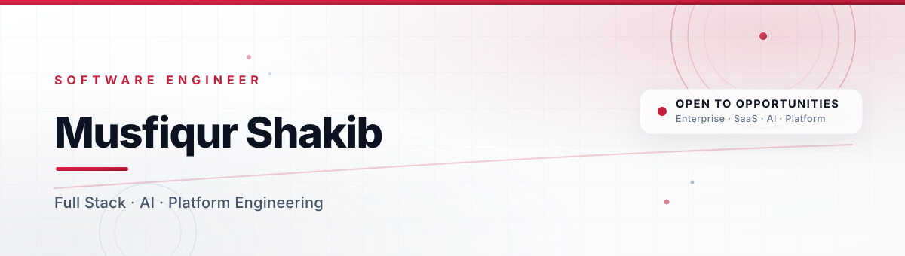
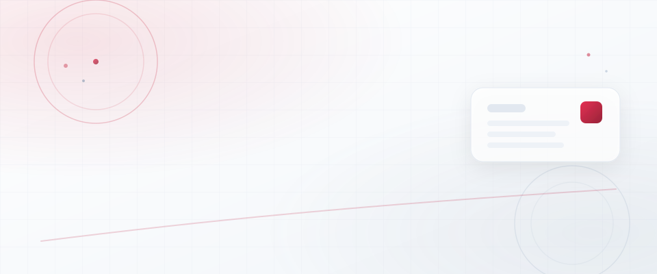
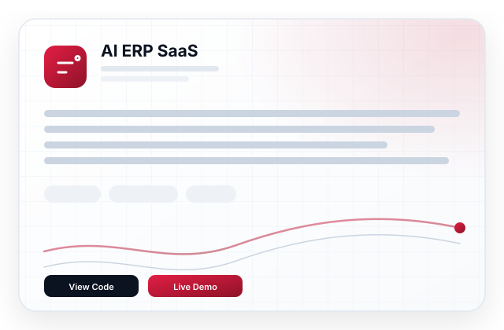

<!-- 1 · HERO BANNER -->

  

<!-- 2 · ANIMATED TYPING -->

  

<!-- 3 · PROFESSIONAL INTRODUCTION -->

  I'm <b>Musfiqur Shakib</b> — a <b>Software Engineer</b> building
  enterprise software, scalable backend systems, AI-powered applications,
  SaaS products and modern web experiences that feel fast, reliable and
  effortless to use.

  
  
  
  

<!-- 4 · ABOUT ME -->
<h3 align="center">ABOUT ME</h3>

<table align="center" width="100%">
  <tr>
    <td align="center" valign="middle" width="30%">
      
       
      
    </td>
    <td valign="middle" width="70%">
      

        Hi, I'm <b>Musfiqur Shakib</b> — a software engineer who loves turning
        complex problems into elegant, production-grade systems.
      

      

        I work across the entire stack: designing resilient APIs, building
        performant frontends, training and serving AI models, and shipping
        cloud-native infrastructure that stays boring in production.
      

      

        My sweet spot is the intersection of <b>engineering discipline</b> and
        <b>product taste</b> — writing code that is fast, testable, and a joy to
        maintain.
      

    </td>
  </tr>
</table>

<!-- 5 · CURRENT FOCUS -->
<h3 align="center">&nbsp; CURRENT FOCUS</h3>

<table align="center" width="100%">
  <tr>
    <td align="center" width="25%">
      <b>Enterprise SaaS</b> 
      <small>Multi-tenant platforms with clean domain modeling</small>
    </td>
    <td align="center" width="25%">
      <b>AI Productization</b> 
      <small>From trained models to APIs people trust</small>
    </td>
    <td align="center" width="25%">
      <b>Scalable Backends</b> 
      <small>Event-driven services built to grow without pain</small>
    </td>
    <td align="center" width="25%">
      <b>Platform &amp; DX</b> 
      <small>Internal tools and pipelines that speed everyone up</small>
    </td>
  </tr>
</table>

<!-- 6 · SKILLS -->
<h3 align="center">&nbsp; SKILLS &amp; EXPERTISE</h3>

  
  
  
  
  
  
  
  

<!-- 7 · TECH STACK -->
<h3 align="center">&nbsp; TECH STACK</h3>

<table align="center" width="100%">
  <tr>
    <td valign="top" width="33%">
      
&nbsp; <b>LANGUAGES</b>

      

         
         
         
         
         
        
      

    </td>
    <td valign="top" width="34%">
      
&nbsp; <b>FRONTEND</b>

      

         
         
         
        
      

      
&nbsp; <b>BACKEND</b>

      

         
         
         
        
      

    </td>
    <td valign="top" width="33%">
      
&nbsp; <b>DATABASE</b>

      

         
         
         
        
      

      
&nbsp; <b>AI &amp; ML</b>

      

         
         
         
        
      

    </td>
  </tr>
  <tr>
    <td valign="top" width="33%">
      
&nbsp; <b>DEVOPS</b>

      

         
         
         
        
      

    </td>
    <td valign="top" width="34%">
      
&nbsp; <b>CLOUD</b>

      

         
        
      

      
&nbsp; <b>PRINCIPLES</b>

      

         
         
        
      

    </td>
    <td valign="top" width="33%">
      
&nbsp; <b>TOOLS</b>

      

         
         
         
        
      

    </td>
  </tr>
</table>

<!-- 8 · FEATURED PROJECTS -->
<h3 align="center">&nbsp; FEATURED PROJECTS</h3>

<table align="center" width="100%">
  <tr>
    <td valign="top" width="32%">
      <table border="1" width="100%" cellpadding="14">
        <tr><td>
          <b>AI ERP SaaS</b>
            
          <small>Intelligent ERP with AI-driven forecasting, inventory and reporting for growing enterprises.</small>
            
          <code>NestJS · PostgreSQL · Redis · PyTorch</code>
            
          
          
        </td></tr>
      </table>
    </td>
    <td>&nbsp;&nbsp;&nbsp;</td>
    <td valign="top" width="32%">
      <table border="1" width="100%" cellpadding="14">
        <tr><td>
          <b>Enterprise Restaurant System</b>
            
          <small>Full lifecycle restaurant management — orders, kitchen, billing, inventory and analytics.</small>
            
          <code>Laravel · MySQL · Livewire</code>
            
          
          
        </td></tr>
      </table>
    </td>
    <td>&nbsp;&nbsp;&nbsp;</td>
    <td valign="top" width="32%">
      <table border="1" width="100%" cellpadding="14">
        <tr><td>
          <b>Medical Herb AI</b>
            
          <small>AI-powered classifier and encyclopedia for medicinal herbs built on computer vision.</small>
            
          <code>Python · OpenCV · TensorFlow · FastAPI</code>
            
          
          
        </td></tr>
      </table>
    </td>
  </tr>
  <tr>
    <td>&nbsp;  &nbsp;</td>
  </tr>
  <tr>
    <td valign="top" width="32%">
      <table border="1" width="100%" cellpadding="14">
        <tr><td>
          <b>Portfolio Website</b>
            
          <small>Premium animated personal site with glassmorphism and micro-interactions.</small>
            
          <code>Next.js · Tailwind · Framer Motion</code>
            
          
          
        </td></tr>
      </table>
    </td>
    <td>&nbsp;&nbsp;&nbsp;</td>
    <td valign="top" width="32%">
      <table border="1" width="100%" cellpadding="14">
        <tr><td>
          <b>Facebook Landing Page Builder</b>
            
          <small>Drag-and-drop builder that generates pixel-perfect landing pages from templates.</small>
            
          <code>React · Node.js · Express</code>
            
          
          
        </td></tr>
      </table>
    </td>
    <td>&nbsp;&nbsp;&nbsp;</td>
    <td valign="top" width="32%">
      <table border="1" width="100%" cellpadding="14">
        <tr><td>
          <b>Ekushey Coding</b>
            
          <small>Platform that makes learning to code approachable and joyful in Bengali.</small>
            
          <code>Next.js · NestJS · MongoDB</code>
            
          
          
        </td></tr>
      </table>
    </td>
  </tr>
</table>

<!-- 9 · GITHUB STATISTICS · 10 · GITHUB STREAK -->
<h3 align="center">&nbsp; GITHUB STATISTICS &amp; STREAK</h3>

<table align="center" width="100%">
  <tr>
    <td align="center" valign="middle" width="50%">
      
    </td>
    <td align="center" valign="middle" width="50%">
      
    </td>
  </tr>
</table>

<!-- 11 · TOP LANGUAGES -->
<h3 align="center">&nbsp; TOP LANGUAGES</h3>

  

<!-- 12 · GITHUB TROPHY -->
<h3 align="center">&nbsp; GITHUB TROPHIES</h3>

  

<!-- 13 · CONTRIBUTION SNAKE -->
<h3 align="center">&nbsp; CONTRIBUTION SNAKE</h3>

  <picture>
    <source media="(prefers-color-scheme: dark)" srcset="https://raw.githubusercontent.com/sHakibMusfiqur/sHakibMusfiqur/output/github-contribution-grid-snake-dark.svg"/>
    <source media="(prefers-color-scheme: light)" srcset="https://raw.githubusercontent.com/sHakibMusfiqur/sHakibMusfiqur/output/github-contribution-grid-snake.svg"/>
    
  </picture>

<!-- 14 · ACTIVITY GRAPH -->
<h3 align="center">&nbsp; ACTIVITY GRAPH</h3>

  

<!-- 15 · CODING PHILOSOPHY -->
<h3 align="center">&nbsp; CODING PHILOSOPHY</h3>

<table align="center" width="100%">
  <tr>
    <td valign="top" width="32%">
      <table border="1" width="100%" cellpadding="14">
        <tr><td align="center">
            
          <b>Clarity over cleverness</b>  
          <small>Readable, maintainable code wins. Simplicity is what scales.</small>
        </td></tr>
      </table>
    </td>
    <td>&nbsp;&nbsp;&nbsp;</td>
    <td valign="top" width="32%">
      <table border="1" width="100%" cellpadding="14">
        <tr><td align="center">
            
          <b>Automation by default</b>  
          <small>If it runs twice, it gets automated. Machines handle the repeatable.</small>
        </td></tr>
      </table>
    </td>
    <td>&nbsp;&nbsp;&nbsp;</td>
    <td valign="top" width="32%">
      <table border="1" width="100%" cellpadding="14">
        <tr><td align="center">
            
          <b>Measure, then optimize</b>  
          <small>Decisions driven by data and benchmarks, never by guesses.</small>
        </td></tr>
      </table>
    </td>
  </tr>
</table>

<!-- 16 · DEVELOPMENT WORKFLOW -->
<h3 align="center">&nbsp; DEVELOPMENT WORKFLOW</h3>

<table align="center" width="100%">
  <tr>
    <td align="center" valign="middle" width="16%">
       <b>DISCOVER</b> 
      <small>Understand the problem</small>
    </td>
    <td align="center" valign="middle" width="6%"></td>
    <td align="center" valign="middle" width="16%">
       <b>DESIGN</b> 
      <small>Model &amp; architect</small>
    </td>
    <td align="center" valign="middle" width="6%"></td>
    <td align="center" valign="middle" width="16%">
       <b>BUILD</b> 
      <small>Ship clean code</small>
    </td>
    <td align="center" valign="middle" width="6%"></td>
    <td align="center" valign="middle" width="16%">
       <b>DEPLOY</b> 
      <small>Release with CI/CD</small>
    </td>
    <td align="center" valign="middle" width="6%"></td>
    <td align="center" valign="middle" width="16%">
       <b>ITERATE</b> 
      <small>Measure &amp; improve</small>
    </td>
  </tr>
</table>

<!-- 17 · CONTACT -->
<h3 align="center">&nbsp; LET'S CONNECT</h3>

  
  
  

  Open to collaborations on enterprise software, AI products and anything
  that makes developers more productive.

<!-- 18 · FOOTER -->

