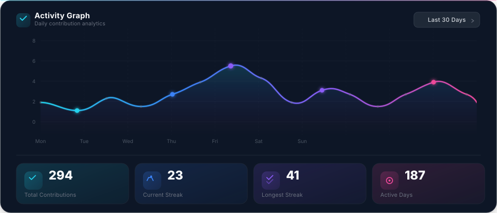

<!-- 1 · HERO BANNER -->

  

<!-- 2 · ANIMATED TYPING -->

  

<!-- 3 · PROFESSIONAL INTRODUCTION -->

  I'm <b>Musfiqur Shakib</b> — a <b>Software Engineer</b> building
  enterprise software, scalable backend systems, AI-powered applications,
  SaaS products and modern web experiences that feel fast, reliable and
  effortless to use.

  
  
  
  

<!-- 4 · ABOUT ME -->

<b>ABOUT ME</b>

<table align="center" width="100%">
  <tr>
    <td align="center" valign="middle" width="30%">
      
       
      
    </td>
    <td valign="middle" width="70%">
      

        Hi, I'm <b>Musfiqur Shakib</b> — a software engineer who loves turning
        complex problems into elegant, production-grade systems.
      

      

        I work across the entire stack: designing resilient APIs, building
        performant frontends, training and serving AI models, and shipping
        cloud-native infrastructure that stays boring in production.
      

      

        My sweet spot is the intersection of <b>engineering discipline</b> and
        <b>product taste</b> — writing code that is fast, testable, and a joy to
        maintain.
      

    </td>
  </tr>
</table>

<!-- PINNED TECHNOLOGIES -->

<b>&nbsp; PINNED TECHNOLOGIES</b>

  

<!-- 7 · TECH STACK -->

<b>&nbsp; TECH STACK</b>

<table align="center" width="100%">
  <tr>
    <td valign="top" width="33%">
      
&nbsp; <b>LANGUAGES</b>

      

        
      

    </td>
    <td valign="top" width="34%">
      
&nbsp; <b>FRONTEND</b>

      

        
      

      
&nbsp; <b>BACKEND</b>

      

        
      

    </td>
    <td valign="top" width="33%">
      
&nbsp; <b>DATABASE</b>

      

        
      

      
&nbsp; <b>AI &amp; ML</b>

      

        
      

    </td>
  </tr>
  <tr>
    <td valign="top" width="33%">
      
&nbsp; <b>DEVOPS</b>

      

        
      

    </td>
    <td valign="top" width="34%">
      
&nbsp; <b>CLOUD</b>

      

        
      

      
&nbsp; <b>PRINCIPLES</b>

      

        
      

    </td>
    <td valign="top" width="33%">
      
&nbsp; <b>TOOLS</b>

      

        
      

    </td>
  </tr>
</table>

<!-- 9 · GITHUB STATS DASHBOARD -->

<b>&nbsp; GITHUB STATS</b>

  

<!-- 13 · CONTRIBUTION SNAKE -->

<b>&nbsp; CONTRIBUTION SNAKE</b>

  <picture>
    <source media="(prefers-color-scheme: dark)" srcset="https://raw.githubusercontent.com/sHakibMusfiqur/sHakibMusfiqur/output/github-contribution-grid-snake-dark.svg"/>
    <source media="(prefers-color-scheme: light)" srcset="https://raw.githubusercontent.com/sHakibMusfiqur/sHakibMusfiqur/output/github-contribution-grid-snake.svg"/>
    
  </picture>

<!-- 14 · ACTIVITY GRAPH -->

<b>&nbsp; ACTIVITY GRAPH</b>

  

