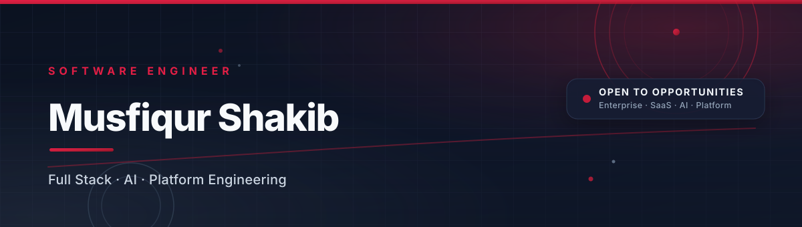
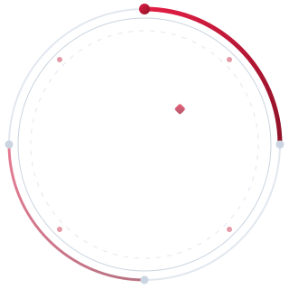

<!-- 1 · HERO BANNER -->

  

<!-- 2 · ANIMATED TYPING -->

  

<!-- 3 · PROFESSIONAL INTRODUCTION -->

  I'm <b>Musfiqur Shakib</b> — a <b>Software Engineer</b> building
  enterprise software, scalable backend systems, AI-powered applications,
  SaaS products and modern web experiences that feel fast, reliable and
  effortless to use.

  
  
  
  

<!-- 4 · ABOUT ME -->

<b>ABOUT ME</b>

<table align="center" width="100%">
  <tr>
    <td align="center" valign="middle" width="30%">
      
       
      
    </td>
    <td valign="middle" width="70%">
      

        Hi, I'm <b>Musfiqur Shakib</b> — a software engineer who loves turning
        complex problems into elegant, production-grade systems.
      

      

        I work across the entire stack: designing resilient APIs, building
        performant frontends, training and serving AI models, and shipping
        cloud-native infrastructure that stays boring in production.
      

      

        My sweet spot is the intersection of <b>engineering discipline</b> and
        <b>product taste</b> — writing code that is fast, testable, and a joy to
        maintain.
      

    </td>
  </tr>
</table>

<!-- 5 · CURRENT FOCUS -->

<b>&nbsp; CURRENT FOCUS</b>

<table align="center" width="100%">
  <tr>
    <td align="center" width="25%">
      <b>Enterprise SaaS</b> 
      <small>Multi-tenant platforms with clean domain modeling</small>
    </td>
    <td align="center" width="25%">
      <b>AI Productization</b> 
      <small>From trained models to APIs people trust</small>
    </td>
    <td align="center" width="25%">
      <b>Scalable Backends</b> 
      <small>Event-driven services built to grow without pain</small>
    </td>
    <td align="center" width="25%">
      <b>Platform &amp; DX</b> 
      <small>Internal tools and pipelines that speed everyone up</small>
    </td>
  </tr>
</table>

<!-- 6 · SKILLS -->

<b>&nbsp; SKILLS &amp; EXPERTISE</b>

  
  
  
  

<!-- PINNED TECHNOLOGIES -->

<b>&nbsp; PINNED TECHNOLOGIES</b>

  

<!-- 7 · TECH STACK -->

<b>&nbsp; TECH STACK</b>

<table align="center" width="100%">
  <tr>
    <td valign="top" width="33%">
      
&nbsp; <b>LANGUAGES</b>

      

        
      

    </td>
    <td valign="top" width="34%">
      
&nbsp; <b>FRONTEND</b>

      

        
      

      
&nbsp; <b>BACKEND</b>

      

        
      

    </td>
    <td valign="top" width="33%">
      
&nbsp; <b>DATABASE</b>

      

        
      

      
&nbsp; <b>AI &amp; ML</b>

      

        
      

    </td>
  </tr>
  <tr>
    <td valign="top" width="33%">
      
&nbsp; <b>DEVOPS</b>

      

        
      

    </td>
    <td valign="top" width="34%">
      
&nbsp; <b>CLOUD</b>

      

        
      

      
&nbsp; <b>PRINCIPLES</b>

      

        
      

    </td>
    <td valign="top" width="33%">
      
&nbsp; <b>TOOLS</b>

      

        
      

    </td>
  </tr>
</table>

<!-- 8 · FEATURED PROJECTS -->

<b>&nbsp; FEATURED PROJECTS</b>

<table align="center" width="100%">
  <tr>
    <td valign="top" width="32%">
      <table border="1" width="100%" cellpadding="14">
        <tr><td>
          <b>AI ERP SaaS</b>
            
          <small>Intelligent ERP with AI-driven forecasting, inventory and reporting for growing enterprises.</small>
            
          <code>NestJS · PostgreSQL · Redis · PyTorch</code>
            
          
        </td></tr>
      </table>
    </td>
    <td>&nbsp;&nbsp;&nbsp;</td>
    <td valign="top" width="32%">
      <table border="1" width="100%" cellpadding="14">
        <tr><td>
          <b>Enterprise Restaurant System</b>
            
          <small>Full lifecycle restaurant management — orders, kitchen, billing, inventory and analytics.</small>
            
          <code>Laravel · MySQL · Livewire</code>
            
          
        </td></tr>
      </table>
    </td>
    <td>&nbsp;&nbsp;&nbsp;</td>
    <td valign="top" width="32%">
      <table border="1" width="100%" cellpadding="14">
        <tr><td>
          <b>Medical Herb AI</b>
            
          <small>AI-powered classifier and encyclopedia for medicinal herbs built on computer vision.</small>
            
          <code>Python · OpenCV · TensorFlow · FastAPI</code>
            
          
        </td></tr>
      </table>
    </td>
  </tr>
  <tr>
    <td>&nbsp;  &nbsp;</td>
  </tr>
  <tr>
    <td valign="top" width="32%">
      <table border="1" width="100%" cellpadding="14">
        <tr><td>
          <b>Portfolio Website</b>
            
          <small>Premium animated personal site with glassmorphism and micro-interactions.</small>
            
          <code>Next.js · Tailwind · Framer Motion</code>
            
          
        </td></tr>
      </table>
    </td>
    <td>&nbsp;&nbsp;&nbsp;</td>
    <td valign="top" width="32%">
      <table border="1" width="100%" cellpadding="14">
        <tr><td>
          <b>Facebook Landing Page Builder</b>
            
          <small>Drag-and-drop builder that generates pixel-perfect landing pages from templates.</small>
            
          <code>React · Node.js · Express</code>
            
          
        </td></tr>
      </table>
    </td>
    <td>&nbsp;&nbsp;&nbsp;</td>
    <td valign="top" width="32%">
      <table border="1" width="100%" cellpadding="14">
        <tr><td>
          <b>Ekushey Coding</b>
            
          <small>Platform that makes learning to code approachable and joyful in Bengali.</small>
            
          <code>Next.js · NestJS · MongoDB</code>
            
          
        </td></tr>
      </table>
    </td>
  </tr>
</table>

<!-- CURRENTLY BUILDING -->

<b>&nbsp; CURRENTLY BUILDING</b>

<table align="center" width="100%">
  <tr>
    <td align="center" width="25%">
        
      <b>AI ERP SaaS</b> 
      <small>AI-driven enterprise planning</small>
    </td>
    <td align="center" width="25%">
        
      <b>Medical Herb AI</b> 
      <small>Computer vision for herbal medicine</small>
    </td>
    <td align="center" width="25%">
        
      <b>Portfolio Website</b> 
      <small>Premium animated personal site</small>
    </td>
    <td align="center" width="25%">
        
      <b>Facebook Landing Page Builder</b> 
      <small>Drag-and-drop pixel-perfect pages</small>
    </td>
  </tr>
</table>

<!-- RESEARCH -->

<b>&nbsp; RESEARCH</b>

<table align="center" width="100%">
  <tr>
    <td>
      <table border="1" width="100%" cellpadding="16">
        <tr><td align="center">
          <b>Spatial Attention Based Multi-scale Feature Fusion Medical Herb Identification</b>
            
          <small>Computer vision research applying spatial attention and multi-scale feature fusion to medicinal herb recognition.</small>
        </td></tr>
      </table>
    </td>
  </tr>
</table>

<!-- 9 · GITHUB STATS DASHBOARD -->

<b>&nbsp; GITHUB STATS</b>

  

<!-- 13 · CONTRIBUTION SNAKE -->

<b>&nbsp; CONTRIBUTION SNAKE</b>

  <picture>
    <source media="(prefers-color-scheme: dark)" srcset="https://raw.githubusercontent.com/sHakibMusfiqur/sHakibMusfiqur/output/github-contribution-grid-snake-dark.svg"/>
    <source media="(prefers-color-scheme: light)" srcset="https://raw.githubusercontent.com/sHakibMusfiqur/sHakibMusfiqur/output/github-contribution-grid-snake.svg"/>
    
  </picture>

<!-- 14 · ACTIVITY GRAPH -->

<b>&nbsp; ACTIVITY GRAPH</b>

  

<!-- 18 · FOOTER QUOTE -->

  <i>"Simplicity is the ultimate sophistication — build software that
  outlives the hype."</i> 
  <small>&#8212; Musfiqur Shakib</small>

<!-- 19 · FOOTER -->

  <picture>
    <source media="(prefers-color-scheme: dark)" srcset="assets/footer-dark.svg"/>
    <source media="(prefers-color-scheme: light)" srcset="assets/footer.svg"/>
    
  </picture>

